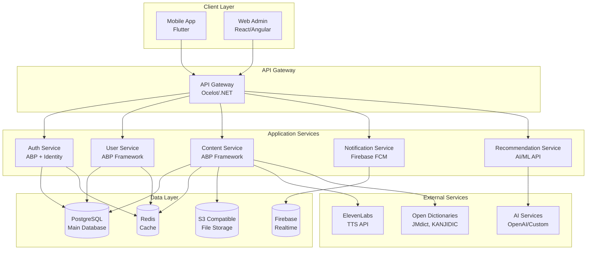
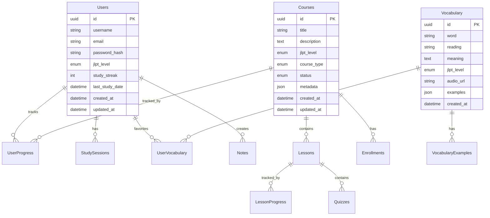
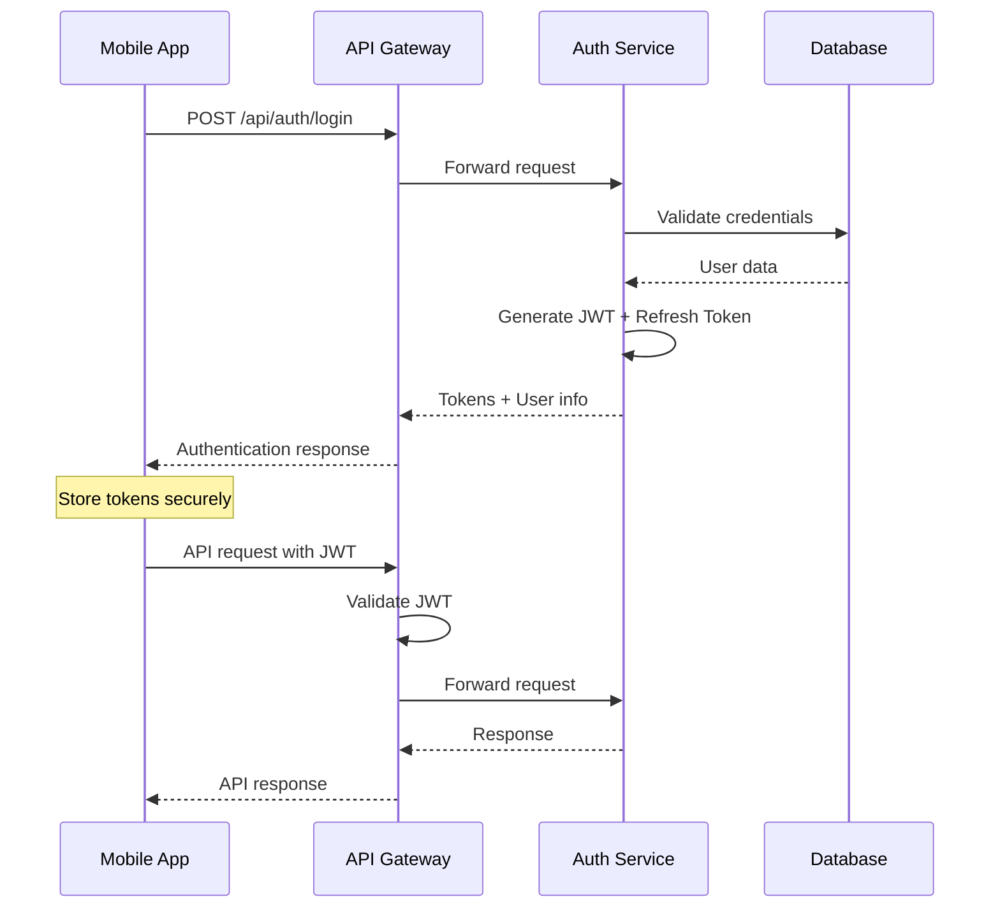

# Tổng quan kiến trúc

## 🏗️ Kiến trúc tổng thể

JLPT Learning App được thiết kế theo mô hình **Multi-tier Architecture** với **Microservices** pattern để đảm bảo tính mở rộng và bảo trì.



## 📱 Mobile App Architecture (Flutter)

### Clean Architecture Pattern
```
lib/
├── core/                     # Shared utilities, constants
│   ├── constants/
│   ├── error/
│   ├── network/
│   └── utils/
├── features/                 # Feature-based modules
│   ├── auth/
│   │   ├── data/            # Data sources, models
│   │   ├── domain/          # Business logic, entities
│   │   └── presentation/    # UI, state management
│   ├── home/
│   ├── dictionary/
│   ├── leaderboard/
│   └── settings/
├── shared/                  # Shared widgets, themes
│   ├── widgets/
│   ├── themes/
│   └── services/
└── main.dart
```

### State Management
- **Primary**: **Bloc Pattern** với `flutter_bloc`
- **Local State**: `setState()` cho simple widgets
- **Global State**: `Bloc` cho complex features
- **Caching**: `Hive` cho offline storage

### Key Libraries
```yaml
dependencies:
  # State Management
  flutter_bloc: ^8.1.3
  equatable: ^2.0.5
  
  # Networking
  dio: ^5.3.2
  retrofit: ^4.0.3
  
  # Local Storage
  hive: ^2.2.3
  hive_flutter: ^1.1.0
  
  # UI Components
  material: ^1.0.0
  cupertino_icons: ^1.0.6
  
  # Firebase
  firebase_core: ^2.15.1
  firebase_auth: ^4.9.0
  firebase_messaging: ^14.6.7
  
  # Utilities
  get_it: ^7.6.4        # Dependency Injection
  auto_route: ^7.8.4    # Navigation
  json_annotation: ^4.8.1
```

## 🔧 Backend Architecture (ABP Framework)

### Domain Driven Design (DDD)
```
src/
├── JLPT.Domain/              # Core business logic
│   ├── Entities/            # Domain entities
│   ├── ValueObjects/        # Value objects
│   ├── DomainServices/      # Domain services
│   └── Repositories/        # Repository interfaces
├── JLPT.Application/         # Application services
│   ├── Services/            # Application services
│   ├── DTOs/                # Data transfer objects
│   └── Contracts/           # Service interfaces
├── JLPT.Infrastructure/      # External concerns
│   ├── Repositories/        # Repository implementations
│   ├── ExternalServices/    # Third-party integrations
│   └── BackgroundJobs/      # Background processing
├── JLPT.Web.Api/            # API controllers
│   ├── Controllers/
│   ├── Middlewares/
│   └── Configuration/
└── JLPT.Tests/              # Unit & integration tests
```

### Core Modules

#### 1. Authentication & Authorization
```csharp
// Identity management với ABP
public class JLPTUser : FullAuditedAggregateRoot<Guid>, IUser
{
    public string UserName { get; set; }
    public string Email { get; set; }
    public JLPTLevel CurrentLevel { get; set; }
    public int StudyStreak { get; set; }
    public DateTime LastStudyDate { get; set; }
    // ...
}

// Permission system
public static class JLPTPermissions
{
    public const string Default = "JLPT";
    
    public static class Users
    {
        public const string Default = $"{JLPTPermissions.Default}.Users";
        public const string Create = Default + ".Create";
        public const string Edit = Default + ".Edit";
        public const string Delete = Default + ".Delete";
    }
}
```

#### 2. Content Management
```csharp
// Course entity
public class Course : FullAuditedAggregateRoot<Guid>
{
    public string Title { get; set; }
    public string Description { get; set; }
    public JLPTLevel Level { get; set; }
    public CourseType Type { get; set; }
    public List<Lesson> Lessons { get; set; }
    public CourseStatus Status { get; set; }
}

// Vocabulary entity
public class Vocabulary : Entity<Guid>
{
    public string Word { get; set; }
    public string Reading { get; set; }
    public string Meaning { get; set; }
    public JLPTLevel Level { get; set; }
    public string AudioUrl { get; set; }
    public List<ExampleSentence> Examples { get; set; }
}
```

#### 3. Progress Tracking
```csharp
public class UserProgress : Entity<Guid>
{
    public Guid UserId { get; set; }
    public Guid CourseId { get; set; }
    public int CompletedLessons { get; set; }
    public int TotalLessons { get; set; }
    public decimal ProgressPercentage => (decimal)CompletedLessons / TotalLessons * 100;
    public DateTime LastAccessDate { get; set; }
}

public class StudySession : Entity<Guid>
{
    public Guid UserId { get; set; }
    public DateTime StartTime { get; set; }
    public DateTime? EndTime { get; set; }
    public TimeSpan Duration => EndTime?.Subtract(StartTime) ?? TimeSpan.Zero;
    public List<StudyActivity> Activities { get; set; }
}
```

### API Design

#### RESTful Endpoints
```
# Authentication
POST   /api/auth/login
POST   /api/auth/register
POST   /api/auth/refresh
DELETE /api/auth/logout

# User Management
GET    /api/users/profile
PUT    /api/users/profile
GET    /api/users/{id}/progress

# Courses
GET    /api/courses
GET    /api/courses/{id}
POST   /api/courses/{id}/enroll
GET    /api/courses/{id}/lessons

# Vocabulary
GET    /api/vocabulary/search?q={term}
GET    /api/vocabulary/{id}
POST   /api/vocabulary/{id}/favorite
GET    /api/vocabulary/favorites

# Leaderboard
GET    /api/leaderboard/global
GET    /api/leaderboard/friends
GET    /api/leaderboard/weekly

# Recommendations
GET    /api/recommendations/courses
GET    /api/recommendations/study-plan
```

#### Response Format
```json
{
  "success": true,
  "data": {
    // Response data
  },
  "message": "Operation completed successfully",
  "errors": [],
  "timestamp": "2024-06-15T10:30:00Z"
}
```

## 🗃️ Database Design

### Entity Relationship Diagram


### Key Tables

#### Users Table
```sql
CREATE TABLE users (
    id UUID PRIMARY KEY DEFAULT gen_random_uuid(),
    username VARCHAR(50) UNIQUE NOT NULL,
    email VARCHAR(255) UNIQUE NOT NULL,
    password_hash VARCHAR(255) NOT NULL,
    current_level VARCHAR(10) DEFAULT 'N5',
    study_streak INTEGER DEFAULT 0,
    total_points INTEGER DEFAULT 0,
    last_study_date TIMESTAMP,
    subscription_type VARCHAR(20) DEFAULT 'FREE',
    subscription_expires_at TIMESTAMP,
    created_at TIMESTAMP DEFAULT NOW(),
    updated_at TIMESTAMP DEFAULT NOW()
);
```

#### Courses Table
```sql
CREATE TABLE courses (
    id UUID PRIMARY KEY DEFAULT gen_random_uuid(),
    title VARCHAR(255) NOT NULL,
    description TEXT,
    jlpt_level VARCHAR(10) NOT NULL,
    course_type VARCHAR(50) NOT NULL, -- VOCABULARY, GRAMMAR, READING, LISTENING
    difficulty_level INTEGER DEFAULT 1,
    estimated_hours INTEGER,
    is_premium BOOLEAN DEFAULT FALSE,
    status VARCHAR(20) DEFAULT 'ACTIVE',
    metadata JSONB,
    created_at TIMESTAMP DEFAULT NOW(),
    updated_at TIMESTAMP DEFAULT NOW()
);
```

#### Vocabulary Table
```sql
CREATE TABLE vocabulary (
    id UUID PRIMARY KEY DEFAULT gen_random_uuid(),
    word VARCHAR(100) NOT NULL,
    reading VARCHAR(100),
    meaning TEXT NOT NULL,
    jlpt_level VARCHAR(10) NOT NULL,
    word_type VARCHAR(50), -- NOUN, VERB, ADJECTIVE, etc.
    audio_url VARCHAR(500),
    difficulty_score DECIMAL(3,2),
    usage_frequency INTEGER DEFAULT 0,
    examples JSONB,
    created_at TIMESTAMP DEFAULT NOW()
);

-- Indexes for performance
CREATE INDEX idx_vocabulary_word ON vocabulary(word);
CREATE INDEX idx_vocabulary_level ON vocabulary(jlpt_level);
CREATE INDEX idx_vocabulary_reading ON vocabulary(reading);
```

## 🔧 Infrastructure Components

### 1. Caching Strategy
```csharp
// Redis caching for frequently accessed data
public class CacheService : ICacheService
{
    private readonly IDistributedCache _cache;
    
    public async Task<T> GetAsync<T>(string key)
    {
        var cached = await _cache.GetStringAsync(key);
        return cached != null ? JsonSerializer.Deserialize<T>(cached) : default;
    }
    
    public async Task SetAsync<T>(string key, T value, TimeSpan expiration)
    {
        var serialized = JsonSerializer.Serialize(value);
        await _cache.SetStringAsync(key, serialized, new DistributedCacheEntryOptions
        {
            AbsoluteExpirationRelativeToNow = expiration
        });
    }
}

// Cache keys
public static class CacheKeys
{
    public static string UserProfile(Guid userId) => $"user:profile:{userId}";
    public static string CourseList(string level) => $"courses:level:{level}";
    public static string Vocabulary(string word) => $"vocabulary:{word}";
    public static string Leaderboard(string type) => $"leaderboard:{type}";
}
```

### 2. Background Jobs
```csharp
// Hangfire background jobs
public class StudyReminderJob
{
    private readonly INotificationService _notificationService;
    
    [AutomaticRetry(Attempts = 3)]
    public async Task SendDailyReminders()
    {
        var inactiveUsers = await GetInactiveUsers();
        
        foreach (var user in inactiveUsers)
        {
            await _notificationService.SendStudyReminderAsync(user.Id);
        }
    }
}

// Schedule jobs
public class JobScheduler
{
    public void ScheduleRecurringJobs()
    {
        // Daily study reminders
        RecurringJob.AddOrUpdate<StudyReminderJob>(
            "daily-study-reminders",
            job => job.SendDailyReminders(),
            Cron.Daily(9)); // 9 AM daily
            
        // Weekly leaderboard updates
        RecurringJob.AddOrUpdate<LeaderboardJob>(
            "weekly-leaderboard-update",
            job => job.UpdateWeeklyRankings(),
            Cron.Weekly(DayOfWeek.Monday));
    }
}
```

### 3. File Storage
```csharp
// S3-compatible storage for audio files
public class FileStorageService : IFileStorageService
{
    private readonly AmazonS3Client _s3Client;
    private readonly string _bucketName;
    
    public async Task<string> UploadAudioAsync(Stream audioStream, string fileName)
    {
        var key = $"audio/{DateTime.UtcNow:yyyy/MM/dd}/{Guid.NewGuid()}-{fileName}";
        
        await _s3Client.PutObjectAsync(new PutObjectRequest
        {
            BucketName = _bucketName,
            Key = key,
            InputStream = audioStream,
            ContentType = "audio/mpeg",
            CannedACL = S3CannedACL.PublicRead
        });
        
        return $"https://{_bucketName}.s3.amazonaws.com/{key}";
    }
}
```

## 🔒 Security Architecture

### 1. Authentication Flow


### 2. Authorization Policies
```csharp
// Permission-based authorization
[Authorize(Policy = "RequireValidSubscription")]
public class PremiumController : ControllerBase
{
    [HttpGet("premium-content")]
    [Authorize(Permissions.PremiumContent.View)]
    public async Task<IActionResult> GetPremiumContent()
    {
        // Premium content logic
    }
}

// Custom authorization handler
public class SubscriptionRequirement : IAuthorizationRequirement { }

public class SubscriptionHandler : AuthorizationHandler<SubscriptionRequirement>
{
    protected override Task HandleRequirementAsync(
        AuthorizationHandlerContext context,
        SubscriptionRequirement requirement)
    {
        var subscription = context.User.FindFirst("subscription")?.Value;
        
        if (subscription == "PREMIUM" || subscription == "TRIAL")
        {
            context.Succeed(requirement);
        }
        
        return Task.CompletedTask;
    }
}
```

## 📊 Monitoring & Logging

### 1. Application Insights
```csharp
// Telemetry tracking
public class TelemetryService : ITelemetryService
{
    private readonly TelemetryClient _telemetryClient;
    
    public void TrackUserAction(string action, Guid userId, Dictionary<string, string> properties = null)
    {
        _telemetryClient.TrackEvent($"User.{action}", properties ?? new Dictionary<string, string>
        {
            ["UserId"] = userId.ToString(),
            ["Timestamp"] = DateTime.UtcNow.ToString("O")
        });
    }
    
    public void TrackLearningProgress(Guid userId, string courseId, decimal progressPercentage)
    {
        _telemetryClient.TrackMetric("LearningProgress", (double)progressPercentage, new Dictionary<string, string>
        {
            ["UserId"] = userId.ToString(),
            ["CourseId"] = courseId,
            ["Level"] = GetUserLevel(userId)
        });
    }
}
```

### 2. Health Checks
```csharp
// Health check configuration
public void ConfigureServices(IServiceCollection services)
{
    services.AddHealthChecks()
        .AddNpgSql(connectionString, name: "postgres")
        .AddRedis(redisConnectionString, name: "redis")
        .AddUrlGroup(new Uri("https://api.elevenlabs.io/health"), name: "elevenlabs")
        .AddCheck<CustomHealthCheck>("custom-check");
}

// Custom health check
public class CustomHealthCheck : IHealthCheck
{
    public async Task<HealthCheckResult> CheckHealthAsync(
        HealthCheckContext context,
        CancellationToken cancellationToken = default)
    {
        try
        {
            // Check external dependencies
            var isHealthy = await CheckExternalServices();
            
            return isHealthy 
                ? HealthCheckResult.Healthy("All systems operational")
                : HealthCheckResult.Degraded("Some services experiencing issues");
        }
        catch (Exception ex)
        {
            return HealthCheckResult.Unhealthy("Health check failed", ex);
        }
    }
}
```

---

🚀 **Tiếp theo**: Xem [Development Guidelines](../development/coding-standards.md) để hiểu về quy chuẩn code và best practices.
