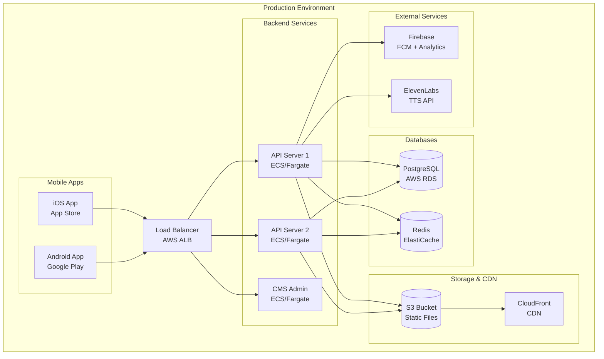

# Hướng dẫn triển khai

## 🎯 Tổng quan Deployment

JLPT Learning App được thiết kế để triển khai trên nhiều môi trường khác nhau với các cấu hình tương ứng:

- **Development**: Local development environment
- **Staging**: Testing environment
- **Production**: Live environment cho end users

## 🏗️ Kiến trúc Deployment



## 📱 Mobile App Deployment

### 1. Build Configuration

#### Flutter Build Flavors
```dart
// lib/main.dart
void main() async {
  WidgetsFlutterBinding.ensureInitialized();
  
  const flavor = String.fromEnvironment('FLAVOR', defaultValue: 'development');
  
  switch (flavor) {
    case 'development':
      await initializeDevelopment();
      break;
    case 'staging':
      await initializeStaging();
      break;
    case 'production':
      await initializeProduction();
      break;
  }
  
  runApp(JLPTApp(config: AppConfig.current));
}
```

#### App Configuration
```dart
// lib/core/config/app_config.dart
class AppConfig {
  const AppConfig({
    required this.apiBaseUrl,
    required this.environment,
    required this.enableAnalytics,
    required this.enableCrashlytics,
  });

  final String apiBaseUrl;
  final Environment environment;
  final bool enableAnalytics;
  final bool enableCrashlytics;

  static late AppConfig current;

  static const development = AppConfig(
    apiBaseUrl: 'https://dev-api.jlpt-app.com',
    environment: Environment.development,
    enableAnalytics: false,
    enableCrashlytics: false,
  );

  static const staging = AppConfig(
    apiBaseUrl: 'https://staging-api.jlpt-app.com',
    environment: Environment.staging,
    enableAnalytics: true,
    enableCrashlytics: true,
  );

  static const production = AppConfig(
    apiBaseUrl: 'https://api.jlpt-app.com',
    environment: Environment.production,
    enableAnalytics: true,
    enableCrashlytics: true,
  );
}
```

### 2. Android Deployment

#### Build Script (`scripts/build-android.bat`)
```cmd
@echo off
setlocal

set FLAVOR=%1
if "%FLAVOR%"=="" set FLAVOR=production

echo Building Android app for %FLAVOR% environment...

REM Clean previous builds
call flutter clean
call flutter pub get

REM Build APK
call flutter build apk --flavor %FLAVOR% --dart-define=FLAVOR=%FLAVOR% --release

REM Build App Bundle for Google Play
call flutter build appbundle --flavor %FLAVOR% --dart-define=FLAVOR=%FLAVOR% --release

echo Build completed successfully!
echo APK: build\app\outputs\flutter-apk\app-%FLAVOR%-release.apk
echo Bundle: build\app\outputs\bundle\%FLAVOR%Release\app-%FLAVOR%-release.aab

pause
```

#### Android Build Configuration
```gradle
// android/app/build.gradle
android {
    compileSdkVersion 34

    defaultConfig {
        applicationId "com.jlptapp.learning"
        minSdkVersion 21
        targetSdkVersion 34
        versionCode flutterVersionCode.toInteger()
        versionName flutterVersionName
        multiDexEnabled true
    }

    signingConfigs {
        release {
            keyAlias keystoreProperties['keyAlias']
            keyPassword keystoreProperties['keyPassword']
            storeFile keystoreProperties['storeFile'] ? file(keystoreProperties['storeFile']) : null
            storePassword keystoreProperties['storePassword']
        }
    }

    buildTypes {
        release {
            signingConfig signingConfigs.release
            minifyEnabled true
            shrinkResources true
            proguardFiles getDefaultProguardFile('proguard-android-optimize.txt'), 'proguard-rules.pro'
        }
    }

    flavorDimensions "environment"
    productFlavors {
        development {
            dimension "environment"
            applicationIdSuffix ".dev"
            versionNameSuffix "-dev"
            resValue "string", "app_name", "JLPT App Dev"
        }
        staging {
            dimension "environment"
            applicationIdSuffix ".staging"
            versionNameSuffix "-staging"
            resValue "string", "app_name", "JLPT App Staging"
        }
        production {
            dimension "environment"
            resValue "string", "app_name", "JLPT Learning"
        }
    }
}
```

### 3. iOS Deployment

#### Build Script (`scripts/build-ios.sh`)
```bash
#!/bin/bash

FLAVOR=${1:-production}
echo "Building iOS app for $FLAVOR environment..."

# Clean previous builds
flutter clean
flutter pub get

# Build iOS
flutter build ios --flavor $FLAVOR --dart-define=FLAVOR=$FLAVOR --release --no-codesign

echo "iOS build completed!"
echo "Open ios/Runner.xcworkspace in Xcode to archive and upload to App Store"
```

#### iOS Configuration (`ios/Runner/Info.plist`)
```xml
<?xml version="1.0" encoding="UTF-8"?>
<!DOCTYPE plist PUBLIC "-//Apple//DTD PLIST 1.0//EN" "http://www.apple.com/DTDs/PropertyList-1.0.dtd">
<plist version="1.0">
<dict>
    <key>CFBundleDisplayName</key>
    <string>$(PRODUCT_NAME)</string>
    <key>CFBundleExecutable</key>
    <string>$(EXECUTABLE_NAME)</string>
    <key>CFBundleIdentifier</key>
    <string>$(PRODUCT_BUNDLE_IDENTIFIER)</string>
    <key>CFBundleName</key>
    <string>jlpt_learning_app</string>
    <key>CFBundlePackageType</key>
    <string>APPL</string>
    <key>CFBundleShortVersionString</key>
    <string>$(FLUTTER_BUILD_NAME)</string>
    <key>CFBundleVersion</key>
    <string>$(FLUTTER_BUILD_NUMBER)</string>
    
    <!-- Network Security -->
    <key>NSAppTransportSecurity</key>
    <dict>
        <key>NSAllowsArbitraryLoads</key>
        <false/>
    </dict>
    
    <!-- Permissions -->
    <key>NSMicrophoneUsageDescription</key>
    <string>This app needs microphone access for pronunciation practice</string>
    <key>NSCameraUsageDescription</key>
    <string>This app needs camera access to scan Japanese text</string>
</dict>
</plist>
```

## 🔧 Backend Deployment

### 1. Docker Configuration

#### API Dockerfile
```dockerfile
# backend/Dockerfile
FROM mcr.microsoft.com/dotnet/aspnet:9.0 AS base
WORKDIR /app
EXPOSE 80
EXPOSE 443

FROM mcr.microsoft.com/dotnet/sdk:9.0 AS build
WORKDIR /src
COPY ["src/JLPT.Web.Api/JLPT.Web.Api.csproj", "src/JLPT.Web.Api/"]
COPY ["src/JLPT.Application/JLPT.Application.csproj", "src/JLPT.Application/"]
COPY ["src/JLPT.Domain/JLPT.Domain.csproj", "src/JLPT.Domain/"]
COPY ["src/JLPT.Infrastructure/JLPT.Infrastructure.csproj", "src/JLPT.Infrastructure/"]

RUN dotnet restore "src/JLPT.Web.Api/JLPT.Web.Api.csproj"
COPY . .
WORKDIR "/src/src/JLPT.Web.Api"
RUN dotnet build "JLPT.Web.Api.csproj" -c Release -o /app/build

FROM build AS publish
RUN dotnet publish "JLPT.Web.Api.csproj" -c Release -o /app/publish

FROM base AS final
WORKDIR /app
COPY --from=publish /app/publish .
ENTRYPOINT ["dotnet", "JLPT.Web.Api.dll"]
```

#### Docker Compose for Development
```yaml
# docker-compose.yml
version: '3.8'

services:
  jlpt-api:
    build:
      context: ./backend
      dockerfile: Dockerfile
    ports:
      - "5000:80"
    environment:
      - ASPNETCORE_ENVIRONMENT=Development
      - ConnectionStrings__Default=Host=postgres;Database=jlpt_dev;Username=jlpt_user;Password=dev_password
      - Redis__ConnectionString=redis:6379
    depends_on:
      - postgres
      - redis
    networks:
      - jlpt-network

  postgres:
    image: postgres:17
    environment:
      POSTGRES_DB: jlpt_dev
      POSTGRES_USER: jlpt_user
      POSTGRES_PASSWORD: dev_password
    ports:
      - "5432:5432"
    volumes:
      - postgres_data:/var/lib/postgresql/data
    networks:
      - jlpt-network

  redis:
    image: redis:7-alpine
    ports:
      - "6379:6379"
    networks:
      - jlpt-network

  nginx:
    image: nginx:alpine
    ports:
      - "80:80"
      - "443:443"
    volumes:
      - ./nginx/nginx.conf:/etc/nginx/nginx.conf
      - ./nginx/ssl:/etc/nginx/ssl
    depends_on:
      - jlpt-api
    networks:
      - jlpt-network

volumes:
  postgres_data:

networks:
  jlpt-network:
    driver: bridge
```

### 2. AWS ECS Deployment

#### ECS Task Definition
```json
{
  "family": "jlpt-api-task",
  "networkMode": "awsvpc",
  "requiresCompatibilities": ["FARGATE"],
  "cpu": "512",
  "memory": "1024",
  "executionRoleArn": "arn:aws:iam::ACCOUNT:role/ecsTaskExecutionRole",
  "taskRoleArn": "arn:aws:iam::ACCOUNT:role/ecsTaskRole",
  "containerDefinitions": [
    {
      "name": "jlpt-api",
      "image": "YOUR_ECR_REPO/jlpt-api:latest",
      "portMappings": [
        {
          "containerPort": 80,
          "protocol": "tcp"
        }
      ],
      "environment": [
        {
          "name": "ASPNETCORE_ENVIRONMENT",
          "value": "Production"
        }
      ],
      "secrets": [
        {
          "name": "ConnectionStrings__Default",
          "valueFrom": "arn:aws:secretsmanager:region:account:secret:jlpt/database"
        }
      ],
      "logConfiguration": {
        "logDriver": "awslogs",
        "options": {
          "awslogs-group": "/ecs/jlpt-api",
          "awslogs-region": "us-west-2",
          "awslogs-stream-prefix": "ecs"
        }
      }
    }
  ]
}
```

#### ECS Service Configuration
```yaml
# infrastructure/ecs-service.yml
version: '3'
services:
  jlpt-api:
    image: ${ECR_REPOSITORY}:${IMAGE_TAG}
    deploy:
      replicas: 2
      restart_policy:
        condition: on-failure
        delay: 5s
        max_attempts: 3
      update_config:
        parallelism: 1
        delay: 10s
        failure_action: rollback
      resources:
        limits:
          cpus: '0.5'
          memory: 1G
        reservations:
          cpus: '0.25'
          memory: 512M
    environment:
      - ASPNETCORE_ENVIRONMENT=Production
    secrets:
      - database_connection
      - jwt_secret
    networks:
      - jlpt-network
    healthcheck:
      test: ["CMD", "curl", "-f", "http://localhost/health"]
      interval: 30s
      timeout: 10s
      retries: 3
      start_period: 40s
```

## 🔄 CI/CD Pipeline

### 1. GitHub Actions Workflow

#### Mobile App CI/CD
```yaml
# .github/workflows/mobile-ci-cd.yml
name: Mobile App CI/CD

on:
  push:
    branches: [main, develop]
    paths: ['mobile-app/**']
  pull_request:
    branches: [main]
    paths: ['mobile-app/**']

jobs:
  test:
    runs-on: ubuntu-latest
    defaults:
      run:
        working-directory: mobile-app
    
    steps:
    - uses: actions/checkout@v4
    
    - name: Setup Flutter
      uses: subosito/flutter-action@v2
      with:
        flutter-version: '3.16.0'
        
    - name: Install dependencies
      run: flutter pub get
      
    - name: Run tests
      run: flutter test --coverage
      
    - name: Upload coverage
      uses: codecov/codecov-action@v3
      with:
        file: mobile-app/coverage/lcov.info

  build-android:
    needs: test
    runs-on: ubuntu-latest
    if: github.ref == 'refs/heads/main'
    defaults:
      run:
        working-directory: mobile-app
    
    steps:
    - uses: actions/checkout@v4
    
    - name: Setup Flutter
      uses: subosito/flutter-action@v2
      with:
        flutter-version: '3.16.0'
        
    - name: Setup Java
      uses: actions/setup-java@v3
      with:
        distribution: 'zulu'
        java-version: '11'
        
    - name: Setup Android SDK
      uses: android-actions/setup-android@v2
      
    - name: Install dependencies
      run: flutter pub get
      
    - name: Build APK
      run: flutter build apk --release --dart-define=FLAVOR=production
      
    - name: Build App Bundle
      run: flutter build appbundle --release --dart-define=FLAVOR=production
      
    - name: Upload to Google Play
      uses: r0adkll/upload-google-play@v1
      with:
        serviceAccountJsonPlainText: ${{ secrets.GOOGLE_PLAY_SERVICE_ACCOUNT }}
        packageName: com.jlptapp.learning
        releaseFiles: mobile-app/build/app/outputs/bundle/productionRelease/app-production-release.aab
        track: internal

  build-ios:
    needs: test
    runs-on: macos-latest
    if: github.ref == 'refs/heads/main'
    defaults:
      run:
        working-directory: mobile-app
    
    steps:
    - uses: actions/checkout@v4
    
    - name: Setup Flutter
      uses: subosito/flutter-action@v2
      with:
        flutter-version: '3.16.0'
        
    - name: Install dependencies
      run: flutter pub get
      
    - name: Build iOS
      run: flutter build ios --release --no-codesign --dart-define=FLAVOR=production
      
    - name: Archive and Upload to TestFlight
      env:
        APPLE_ID: ${{ secrets.APPLE_ID }}
        APPLE_PASSWORD: ${{ secrets.APPLE_PASSWORD }}
      run: |
        cd ios
        xcodebuild -workspace Runner.xcworkspace -scheme Runner -configuration Release archive -archivePath Runner.xcarchive
        xcodebuild -exportArchive -archivePath Runner.xcarchive -exportPath . -exportOptionsPlist ExportOptions.plist
        xcrun altool --upload-app --type ios -f Runner.ipa --username $APPLE_ID --password $APPLE_PASSWORD
```

#### Backend CI/CD
```yaml
# .github/workflows/backend-ci-cd.yml
name: Backend CI/CD

on:
  push:
    branches: [main, develop]
    paths: ['backend/**']
  pull_request:
    branches: [main]
    paths: ['backend/**']

env:
  AWS_REGION: us-west-2
  ECR_REPOSITORY: jlpt-api

jobs:
  test:
    runs-on: ubuntu-latest
    defaults:
      run:
        working-directory: backend
    
    services:
      postgres:
        image: postgres:17
        env:
          POSTGRES_PASSWORD: postgres
          POSTGRES_DB: jlpt_test
        options: >-
          --health-cmd pg_isready
          --health-interval 10s
          --health-timeout 5s
          --health-retries 5
    
    steps:
    - uses: actions/checkout@v4
    
    - name: Setup .NET
      uses: actions/setup-dotnet@v3
      with:
        dotnet-version: '9.0.x'
        
    - name: Restore dependencies
      run: dotnet restore
      
    - name: Build
      run: dotnet build --no-restore
      
    - name: Test
      run: dotnet test --no-build --verbosity normal --collect:"XPlat Code Coverage"
      
    - name: Upload coverage
      uses: codecov/codecov-action@v3
      with:
        file: backend/coverage.xml

  deploy:
    needs: test
    runs-on: ubuntu-latest
    if: github.ref == 'refs/heads/main'
    
    steps:
    - name: Checkout
      uses: actions/checkout@v4
      
    - name: Configure AWS credentials
      uses: aws-actions/configure-aws-credentials@v2
      with:
        aws-access-key-id: ${{ secrets.AWS_ACCESS_KEY_ID }}
        aws-secret-access-key: ${{ secrets.AWS_SECRET_ACCESS_KEY }}
        aws-region: ${{ env.AWS_REGION }}
        
    - name: Login to Amazon ECR
      id: login-ecr
      uses: aws-actions/amazon-ecr-login@v1
      
    - name: Build, tag, and push image to Amazon ECR
      env:
        ECR_REGISTRY: ${{ steps.login-ecr.outputs.registry }}
        IMAGE_TAG: ${{ github.sha }}
      run: |
        docker build -t $ECR_REGISTRY/$ECR_REPOSITORY:$IMAGE_TAG backend/
        docker push $ECR_REGISTRY/$ECR_REPOSITORY:$IMAGE_TAG
        
    - name: Deploy to ECS
      env:
        ECR_REGISTRY: ${{ steps.login-ecr.outputs.registry }}
        IMAGE_TAG: ${{ github.sha }}
      run: |
        aws ecs update-service --cluster jlpt-cluster --service jlpt-api-service --force-new-deployment
```

## 🌍 Infrastructure as Code

### 1. Terraform Configuration

#### Main Infrastructure
```hcl
# infrastructure/main.tf
terraform {
  required_version = ">= 1.0"
  required_providers {
    aws = {
      source  = "hashicorp/aws"
      version = "~> 5.0"
    }
  }
  
  backend "s3" {
    bucket = "jlpt-terraform-state"
    key    = "production/terraform.tfstate"
    region = "us-west-2"
  }
}

provider "aws" {
  region = var.aws_region
}

# VPC and Networking
module "vpc" {
  source = "terraform-aws-modules/vpc/aws"
  
  name = "jlpt-vpc"
  cidr = "10.0.0.0/16"
  
  azs             = ["${var.aws_region}a", "${var.aws_region}b"]
  private_subnets = ["10.0.1.0/24", "10.0.2.0/24"]
  public_subnets  = ["10.0.101.0/24", "10.0.102.0/24"]
  
  enable_nat_gateway = true
  enable_vpn_gateway = false
  
  tags = var.common_tags
}

# RDS PostgreSQL
resource "aws_db_instance" "postgres" {
  identifier = "jlpt-postgres"
  
  engine         = "postgres"
  engine_version = "17.0"
  instance_class = var.db_instance_class
  
  allocated_storage     = 20
  max_allocated_storage = 100
  storage_encrypted     = true
  
  db_name  = "jlpt_production"
  username = var.db_username
  password = var.db_password
  
  vpc_security_group_ids = [aws_security_group.rds.id]
  db_subnet_group_name   = aws_db_subnet_group.postgres.name
  
  backup_retention_period = 7
  backup_window          = "03:00-04:00"
  maintenance_window     = "sun:04:00-sun:05:00"
  
  skip_final_snapshot = false
  final_snapshot_identifier = "jlpt-postgres-final-snapshot-${formatdate("YYYY-MM-DD-hhmm", timestamp())}"
  
  tags = var.common_tags
}

# ElastiCache Redis
resource "aws_elasticache_subnet_group" "redis" {
  name       = "jlpt-redis-subnet-group"
  subnet_ids = module.vpc.private_subnets
}

resource "aws_elasticache_cluster" "redis" {
  cluster_id           = "jlpt-redis"
  engine               = "redis"
  node_type           = var.redis_node_type
  num_cache_nodes     = 1
  parameter_group_name = "default.redis7"
  port                = 6379
  subnet_group_name   = aws_elasticache_subnet_group.redis.name
  security_group_ids  = [aws_security_group.redis.id]
  
  tags = var.common_tags
}

# ECS Cluster
resource "aws_ecs_cluster" "main" {
  name = "jlpt-cluster"
  
  configuration {
    execute_command_configuration {
      logging = "OVERRIDE"
      
      log_configuration {
        cloud_watch_log_group_name = aws_cloudwatch_log_group.ecs.name
      }
    }
  }
  
  tags = var.common_tags
}

# Application Load Balancer
resource "aws_lb" "main" {
  name               = "jlpt-alb"
  internal           = false
  load_balancer_type = "application"
  security_groups    = [aws_security_group.alb.id]
  subnets           = module.vpc.public_subnets
  
  enable_deletion_protection = true
  
  tags = var.common_tags
}
```

### 2. Environment-specific Variables

#### Production Variables
```hcl
# infrastructure/environments/production/terraform.tfvars
aws_region = "us-west-2"

# Database
db_instance_class = "db.t3.medium"
db_username      = "jlpt_user"

# Cache
redis_node_type = "cache.t3.micro"

# ECS
api_cpu    = 512
api_memory = 1024
api_count  = 2

# Common tags
common_tags = {
  Environment = "production"
  Project     = "jlpt-learning-app"
  Owner       = "platform-team"
  Terraform   = "true"
}
```

## 📊 Monitoring & Logging

### 1. Application Monitoring

#### CloudWatch Dashboards
```json
{
  "widgets": [
    {
      "type": "metric",
      "properties": {
        "metrics": [
          ["AWS/ApplicationELB", "RequestCount", "LoadBalancer", "jlpt-alb"],
          ["AWS/ApplicationELB", "TargetResponseTime", "LoadBalancer", "jlpt-alb"],
          ["AWS/ECS", "CPUUtilization", "ServiceName", "jlpt-api-service"],
          ["AWS/ECS", "MemoryUtilization", "ServiceName", "jlpt-api-service"]
        ],
        "period": 300,
        "stat": "Average",
        "region": "us-west-2",
        "title": "JLPT API Metrics"
      }
    }
  ]
}
```

#### Application Insights Configuration
```csharp
// Program.cs
builder.Services.AddApplicationInsightsTelemetry(options =>
{
    options.ConnectionString = builder.Configuration.GetConnectionString("ApplicationInsights");
    options.EnableAdaptiveSampling = true;
    options.EnableQuickPulseMetricStream = true;
});

// Custom telemetry
builder.Services.AddSingleton<ITelemetryInitializer, CustomTelemetryInitializer>();
```

### 2. Health Checks

#### API Health Checks
```csharp
// Program.cs
builder.Services.AddHealthChecks()
    .AddNpgSql(connectionString, name: "postgres")
    .AddRedis(redisConnectionString, name: "redis")
    .AddUrlGroup(new Uri($"{elevenLabsBaseUrl}/health"), name: "elevenlabs")
    .AddCheck<DatabaseHealthCheck>("database-detailed");

app.MapHealthChecks("/health", new HealthCheckOptions
{
    ResponseWriter = UIResponseWriter.WriteHealthCheckUIResponse
});

app.MapHealthChecks("/health/ready", new HealthCheckOptions
{
    Predicate = check => check.Tags.Contains("ready")
});

app.MapHealthChecks("/health/live", new HealthCheckOptions
{
    Predicate = _ => false
});
```

## 🔒 Security & SSL

### 1. SSL Certificate Setup

#### Let's Encrypt with Certbot
```bash
#!/bin/bash
# scripts/setup-ssl.sh

# Install certbot
sudo apt update
sudo apt install certbot python3-certbot-nginx

# Get SSL certificate
sudo certbot --nginx -d api.jlpt-app.com -d www.api.jlpt-app.com

# Auto-renewal
sudo crontab -e
# Add: 0 12 * * * /usr/bin/certbot renew --quiet
```

### 2. Security Headers

#### Nginx Security Configuration
```nginx
# nginx/security.conf
server {
    listen 443 ssl http2;
    server_name api.jlpt-app.com;

    # SSL Configuration
    ssl_certificate /etc/letsencrypt/live/api.jlpt-app.com/fullchain.pem;
    ssl_certificate_key /etc/letsencrypt/live/api.jlpt-app.com/privkey.pem;
    ssl_protocols TLSv1.2 TLSv1.3;
    ssl_ciphers ECDHE-RSA-AES256-GCM-SHA512:DHE-RSA-AES256-GCM-SHA512;
    ssl_prefer_server_ciphers off;

    # Security Headers
    add_header X-Frame-Options DENY;
    add_header X-Content-Type-Options nosniff;
    add_header X-XSS-Protection "1; mode=block";
    add_header Strict-Transport-Security "max-age=63072000; includeSubDomains; preload";
    add_header Content-Security-Policy "default-src 'self'; script-src 'self' 'unsafe-inline'; style-src 'self' 'unsafe-inline'";

    # Rate limiting
    limit_req_zone $binary_remote_addr zone=api:10m rate=10r/s;
    limit_req zone=api burst=20 nodelay;

    location / {
        proxy_pass http://localhost:5000;
        proxy_set_header Host $host;
        proxy_set_header X-Real-IP $remote_addr;
        proxy_set_header X-Forwarded-For $proxy_add_x_forwarded_for;
        proxy_set_header X-Forwarded-Proto $scheme;
    }
}
```

---

🎯 **Hoàn thành**: Bạn đã có tài liệu đầy đủ cho dự án JLPT Learning App! Xem [Project Overview](../intro.md) để review lại toàn bộ dự án.
